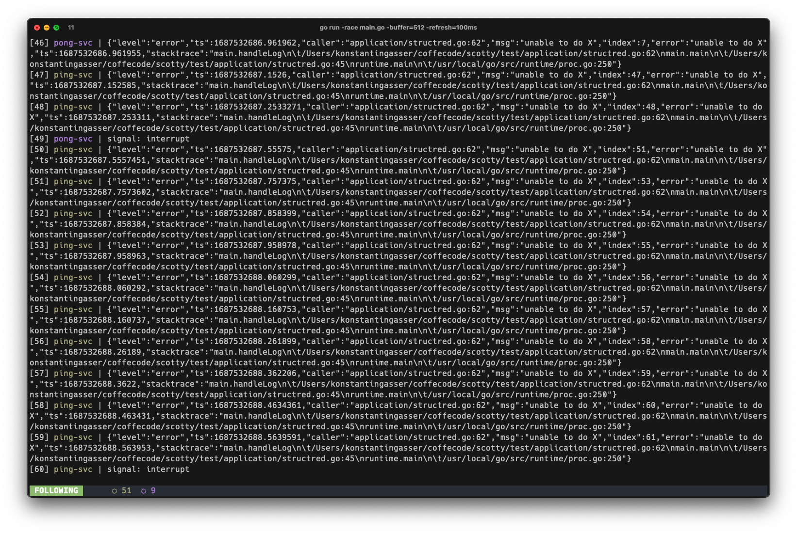
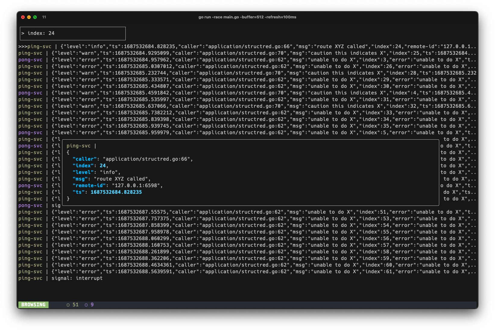

# beam me up, ***scotty***!

<p align="center">
    </img>
</p>


# Idea behind scotty

`scotty` is a result of me being frustrated stichting togther multiple application logs from multiple terminal windows...
Trying to find a bug in a feature which spans multiple services, thus having multiple application logs in multiple terminal windows, simply does not feel right.


With `scotty` all application logs will be merged into one consolidated view! Furthermore, logs are often structured which is again quite useless because terminals don't care about that.
So `scotty` also solves this issue and allows you to browes and format your logs on the fly.

Lasty, why not do something with the logs, if we already gather them?
Why not perform queries on set logs? Even though, not yet implemented `scotty` will be able execute **search** and **aggregation** queries. And all that from just **one** terminal window :)


# Installation


## Homebrew
```
brew tap KonstantinGasser/tap
brew install scotty beam
```


## go installed ?

```
go install github.com/KonstantinGasser/scotty@v0.0.3
go install github.com/KonstantinGasser/beam@v0.0.1
```

## Starting scotty

In oder to maintain a manageable memory footprint `scotty` is using a ring buffer which allows a maxinmum number of logs before starting to overwrite the latest entries.
However, you can choose a size that works for you. scotty will buffer *1024* items by default.
To overwrite this default start scotty with the `-buffer=<size>` flag. 
Depending on the workload you expect you can also adjust the refresh rate of scotty for taling logs. Asuming you expect many many logs (about 1 log every 20ms in average)
it can make sense to increase the `-refresh` flag. By setting a refresh rate scotty will only render logs every refresh intervall (note no logs are lost, only the time until they are displayed increases).

```
$ scotty -buffer=2048
// scotty will store up to 2048 logs before overwriting the latest items
```

Otherwise if *1024* is good enough simply run `$ scotty` to start scotty.


## How to beam logs?

scotty comes with a helper tool called `beam`. beam allows you to pipe content to scotty by pipingeverything read from os.Stdin to scotty.

***Note:***
applications usually print logs to **os.Stderr**. As such you need to redirect the output to **os.Stdout** using `2>&1`.

*Example: Consuming from os.Stderr*

```
$ go run -race engine.go 2>&1 | beam -d engine-svc
  -------------------- ---- ------ -- --------------
          |             |       |   |      |
  command to run your   |       |   |      |
     application        |        \   \     \
                        |         \   \     \______________________
                redirect os.Stderr \   \____________               \
                    to os.Stdout    |               \              |
                                    |               |              |
                            pipe os.Stdout into     |              |
                             os.Stdin of beam       |              |
                                                    |              |
                                            run beam as daemon     |
                                          (dont print logs again)  |
                                                                   |
                                                                   |
                                                      application label displayed
                                                               in soctty
```

`beam` is a humble tool which integrates well in unix pipe chains. As such having `beam` simply be the last command in such a chain of pipes there are many more things you can do!

You can imagine any other command prior to `beam` which produces logs. Say a command to `tail -f` a server logs file or an command which tails logs
from your ECS/EKS (or what not) cluster instances.


## Navigation

By default once a beam connects to scotty the *follow view* is opened. To switch to the *browsing view* hit `SPC` then `b`, to switch back use `SPC` and then `f`. These keys are accessible from anywhere.

<!-- ## Navigation in scotty -->
<!---->
<!-- Once at least one beam is connected to soctty and started beaming logs you see multiple tabs. By using the keys `1`, `2`, `3` and `4` you can navigate between the respective tabs. -->

### TAB: Follow

After the first beam connects to scotty by default the `follow logs` tab is opened. In here you see all logs from all connected beams.
This tab essentaully behaves like the `tail -f` command where each new recorded log is pushed to the end of the screen.
Use the `p` key to pause the tailing and resume by pressing `p` again. With the `g` key you can load the latest logs from the buffer (usefull while tailing is paused).



### TAB: Browse

The inital tab content will not show much, but rather ask you to provide an index of the log item which you want to format (in the `Follow logs` tab each log as an index as prefix which you can use and refer to in this tab).
After you hit enter you will see the requested log is formatted and next logs are shown in the background.
With the keys `j` and `k` you can format the next or previous log. Different from the tailing view while in the browsing view logs are not reloaded (tailed) when new logs are received, however using the `r` key you
can reload the latest logs. Reloading will cause the selected formatted log line to update.



### TAB: Query

Well this is still in the making but will come soon :)

### TAB: Docs

This tab does already exist but requires some content...once there you can see tips/tricks and general information about how-tos


## Status of a beam

Afterna beam has connected to scotty, scotty will remember the beam when it reconnects. In local development it is common to restart an application after making some changes.
Since scotty assigns a random color to each beam this color persists through reconnects/restarts of a beam/application as well as the log count for the beam.
In the following figure you can see the states a beam:

```
┌───────────────────────────────────────────────────┐
│ ● ping-svc: 2 - ◍ pong-svc: 4 - ◌ ding-svc: X     │
└───────────────────────────────────────────────────┘
  _|_ ___|___ _|_  _______|_______
   1     2     3      next beam

// 1) ● -> connected, ◍ -> following paused, ◌ -> disconnected
// 2) beam name as provided by the beam command
// 3) log count of the beam
```

## If it fails, it fails!

Since scotty is still in early development you might run into a panic..In this case you might have trouble starting scotty again. This happens due to soctty
not being able to clean up the unix-socket resources..unless changed by the `-addr` flag you need to remove the default scotty unix socket which is located here:  `/tmp/scotty.sock`


## Contributions

Happy about any issue reports or feature requests! If you want to work on a feature or issue please read through the [contribution guidelines](CONTRIBUTING.md).

*Tip for running and testing locally:*

Within the repository there is a dummy application in `test/application/strcutred.go`. This file produces structred logs of a random log level. After starting scotty with `go run -race main.go -buffer=1024` you can use this dummy application to produce random logs like so:

```
go run -race test/application/structured.go -delay=250 | beam -d test-svc
```

The dummy application takes a **delay** flag which describes the frequency to the logs are produced. By default the delay is set to 100ms. Which means after a log is send the next log is send at most 100ms after the previous.

This can be quite usefull in case you want to benchmark a change you did (sure benchmarks are also good thing but sometimes its good to just see how the entire application behavious under presure). Or increase the delay if you want to think while events a created :D

## Acknowledgements

- UI framework: [bubbletee](https://github.com/charmbracelet/bubbletea) go check it out!
- Styling: [lipglosss](https://github.com/charmbracelet/lipgloss) simple and great styling
