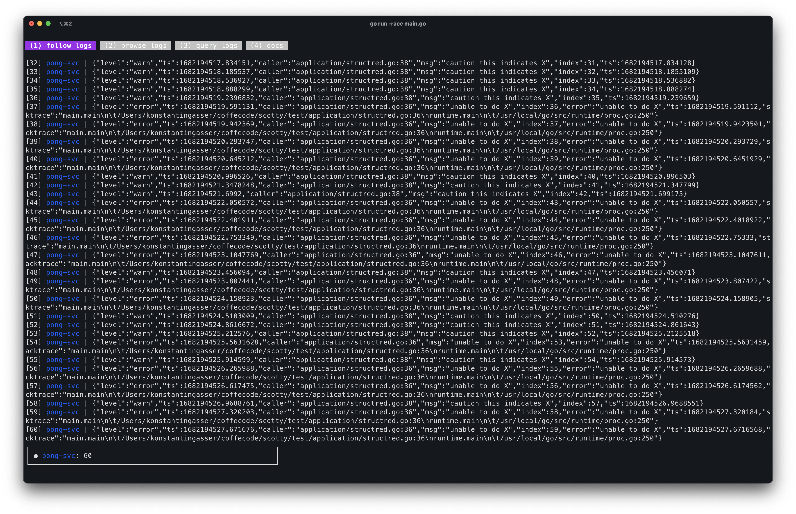
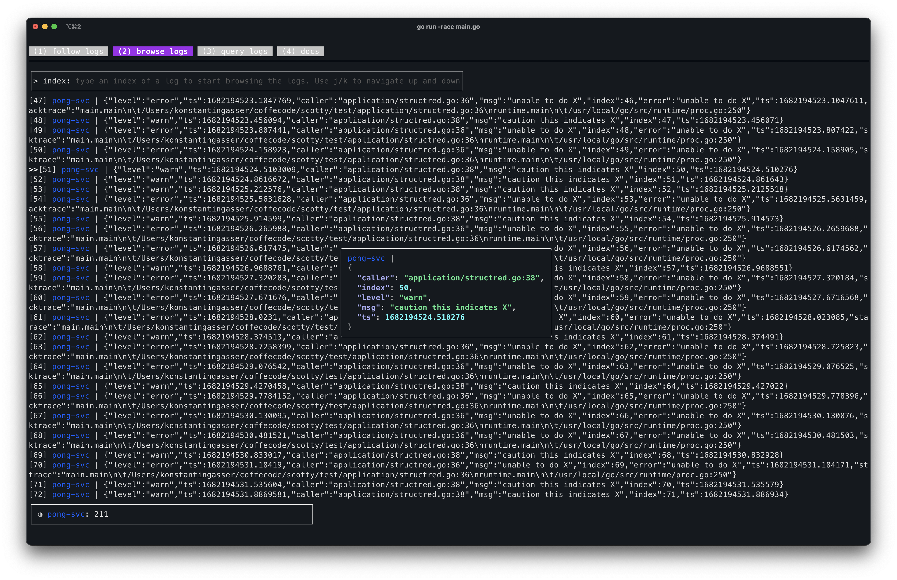

# beam me up, ***scotty***!

<p align="center">
    </img>
</p>


# Idea behin scotty

`scotty` is an result after being frustrated stiching togther application logs from multiple terminal windows - Instead I wanted on merged view of all application logs. Furthermore, terminals do not support formatting and parsing structred logs as such nice to have structred logs but quite usless for local development..so `scotty` also enables developers to brows the logs.
`scotty` is a result of me being frusted stichting togther multiple application logs printed to std-err of a terminal window. Tring to find a bug in feature which includes multiple services, thus multiple application logs in multiple terminal windows, simply does not feel right.
With `scotty` all application logs you want will be merged ito a consolidated view! Furthermore, logs often times are structured which however, is again quite usless because terminals don't care about that. So `scotty` also solves this issue and allows you to brows and format your logs on the fly.

Lasty, why not do something with the logs, if we already gathered them into one?
Why not perform queries on set logs? Eventhough not yet implemented `scotty` will be able execute **search** and **aggregation** queries. And  all that from just **one** termianl window :)

# Installation

## Homebrew
```
brew tap KonstantinGasser/tap
brew install scotty beam
```


## go installed ?

```
go install github.com/KonstantinGasser/scotty@v0.0.1
go install github.com/KonstantinGasser/beam@v0.0.1
```

## Starting scotty

In oder to maintain a managable memory footprint `scotty` is using a ring buffer internally which allows a maxium number of logs before starting to overwrite the latest entries.
However, you can choose a size that works for you by default scotty will buffer *1024* items. To overwrite this default
start scotty using the `-buffer=<size>` flag.

```
$ scotty -buffer=2048
// scotty will store up to 2048 logs before overwriting the latest items
```

Otherwise if *1024* is good enough simply run `$ scotty` to start scotty.


## How to beam logs?

scotty comes with a helper tool called `beam`. Beam allows you to pipe content to scotty by piping it to os.Stdin.

***Note:***
applications usually print logs to **os.Stderr** as such you need to redirect the output to **os.Stdout** using `2>&1`.

*Example consuming from os.Stderr*

```
$ go run -race engine.go 2>&1 | beam -d engine-svc
  -------------------- ---- ------ -- --------------
            |           |       |   |      |
  command to run your   |       |   |      |
     application        |        \   \     \
                        |         \   \     \______________________
                redirect os.Stderr \   \____________               \
                    to os.Stdout    |               \              |
                                    |               |              |
                            pipe os.Stdout into     |              |
                             os.Stdin of beam       |              |
                                                    |              |
                                            run beam as daemon     |
                                          (dont print logs again)  |
                                                                   |
                                                                   |
                                                      application label displayed
                                                               in soctty
```

`beam` is a humble tool which integrates well in unix pip chains and as such having `beam` just be the last command in a such a chain of pipes there are many more thinks you can do!

You can imagine any other command prior to `beam` which productes logs say a command to `tail -f` a server logs file or an command which tails logs
from your ECS/EKS (or what not) cluster instances.


## Navigation in scotty

Once at least one beam is connected to soctty and started beaming logs you see multiple tabs. By using the keys `1`, `2`, `3` and `4` you can navigate between the respective tabs.

### TAB: Follow

After the first beam connects to scotty by default the `follow logs` tab is opened. In here you see all logs from all connected beams.
This tab essentaully behaves like the `tail -f` command where each new recorded log is pushed to the end of the screen.



### TAB: Browse

The inital tab content will not show much but rather ask you to provide a starting index of the log item which you want to format (in the `Follow logs` tab each log as a index as prefix which you can use and refer to it in this tab).
After you hit enter you will see the requested log is formatted and next logs are shown in the background.
With the keys `j` and `k` you can format the next or previous log.



### TAB: Query

Well this is still in the making but will come soon :)

### TAB: Docs

This tab does already exist but requires some conntent...once there you can see tips/tricks and general information about how-tos


## Status of a beam

After connected once scotty will remember beams when they reconnect. In local development is common to restart an application after making some changes.
Since scotty assigns a random color to each stream this color perists throught reconnects/restarts of a beam/application as well as the log count for the beam.
In the following graphic you can see the states a beam can be in:

```
┌───────────────────────────────────────────────────┐
│ ● ping-svc: 2 - ◍ pong-svc: 4 - ◌ ding-svc: X     │
└───────────────────────────────────────────────────┘
  _|_ ___|___ _|_  _______|_______
   1     2     3      next beam

// 1) status: ● -> connected, ◍ -> following paused, ◌ -> disconnected
// 2) beam name as provided by the beam command
// 3) log count of the beam
```

## If it fails, it fails!

Since scotty is still in early development you might run into a panic..In this case you might have troubles starting scotty again because due to the panic soctty
was not able to clean the unix-socket resources..unless changes by the `-addr` flag you need to remove the default soctty unix socket which is located here:  `/tmp/scotty.sock`


## Contributions

Happy for any issue report or feature request! If you want to work on a feature or issue please read through the [contribution guidelines](CONTRIBUTING.md)

## Acknowledgements

- UI framework used [bubbletee](https://github.com/charmbracelet/bubbletea) go check it out!
- Styling [lipglosss](https://github.com/charmbracelet/lipgloss) simple and great styling
